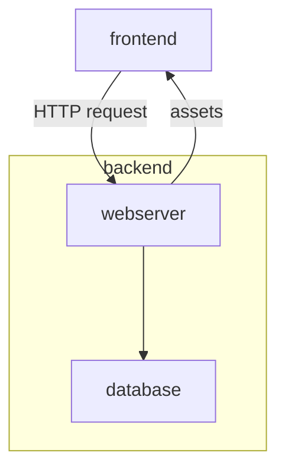

# hero-start

Projeto para iniciantes com implementações comuns no dia a dia de um desenvolvedor web.

Meta Geral do Projeto: https://github.com/PauloHFS/hero-start/issues/1

## Arquitetura

```mermaid
flowchart TB
  frontend-- HTTP request -->webserver
  webserver-- assets -->frontend
  subgraph backend
    webserver--->database
  end
```
